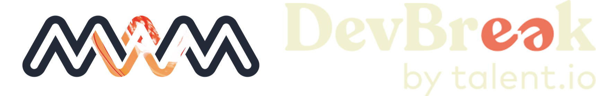

# 🎉  Welcome to our DevBreak 2021 workshop  🎉

## Introduction to audio programming

Audio and music are everywhere in our everyday life: at home, at work, when we go shopping, in our cars etc. The vast majority of the apps on our mobile devices use audio in some way, and yet, most of us programmers are not aware of the ins and outs of audio programming. In this workshop, we will introduce you to the challenges audio programmers face daily.

The objective of the workshop will be to code simple audio applications in C/C++ to play around with sound, music and audio effects.

This workshop is animated by [MWM](http://musicworldmedia.com/), world's leading mobile creative apps publisher, as part of the [DevBreak festival 2021](https://www.devbreak.io/).

## Setup and requirements

Before attending the workshop, please read the document [_Setup and requirements_](Documentation/SetupRequirements.md).

## Workshop projects

You will be guided through the projects during the workshop.

## Legal

### Software license

The projects and all software code in the directory `Projects` are licensed under the MIT license. For more information, please read the license provided for in this repository: [Software_License.md](Software_License.md).

### MWM track's license

For the purpose of the Devbreak 2021, MWM provides you for free with tracks, in the directory `Tracks`, for your own personal and non-commercial use. You can not use them for any commercial use. For more information, please read the licence provided for in this repository: [MWM_Tracks_License.md](MWM_Tracks_License.md).
